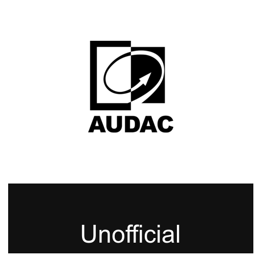

# ha-audac

Home Assistant HACS repository for Audac MTX devices.
This is an unofficial Audac implementation and is not affiliated with or endorsed by Audac.

Current device focus:
- MTX48 (4 zones)
- MTX88 (8 zones)

## Features

- Config flow for MTX over TCP/IP (`port 5001`)
- One config entry per physical MTX device
- Per-zone entities:
  - `number` -> volume (0..70, attenuation in dB)
  - `switch` -> mute
  - `select` -> input source (0..8 mapped to labels)
- Firmware sensor
- Raw command service (`audac.send_raw_command`) for advanced commands (`SAVE`, `DEF`, `GZI01`, ...)

## Install (HACS)

1. HACS -> Integrations -> 3 dots -> Custom repositories
2. Add this repository URL as category `Integration`
3. Install `Audac MTX`
4. Restart Home Assistant
5. Settings -> Devices & Services -> Add Integration -> `Audac MTX`

## MTX protocol details

This integration uses the command framing from `MTX_Commands_Manual.pdf`:

- TCP/IP port: `5001`
- Frame format: `#|destination|source|command|argument|checksum|\r\n`
- Default device address: `X001`
- Checksum: `U` (accepted by MTX)

Polled commands:
- `GVALL` volume list
- `GRALL` routing list
- `GMALL` mute list
- `GSV` firmware

Write commands used by entities:
- `SVx` set zone volume
- `SRx` set zone routing/source
- `SM0x` set zone mute

## Service

Service: `audac.send_raw_command`

Fields:
- `entry_id` (required)
- `command` (required)
- `argument` (optional, default `0`)

## Dashboard examples

See:
- `/Users/tguldener/Documents/codex/ha-audac/examples/dashboard/tile-grid.yaml`
- `/Users/tguldener/Documents/codex/ha-audac/examples/dashboard/stacked-controls.yaml`
- `/Users/tguldener/Documents/codex/ha-audac/examples/dashboard/mini-audio-panel.yaml`
